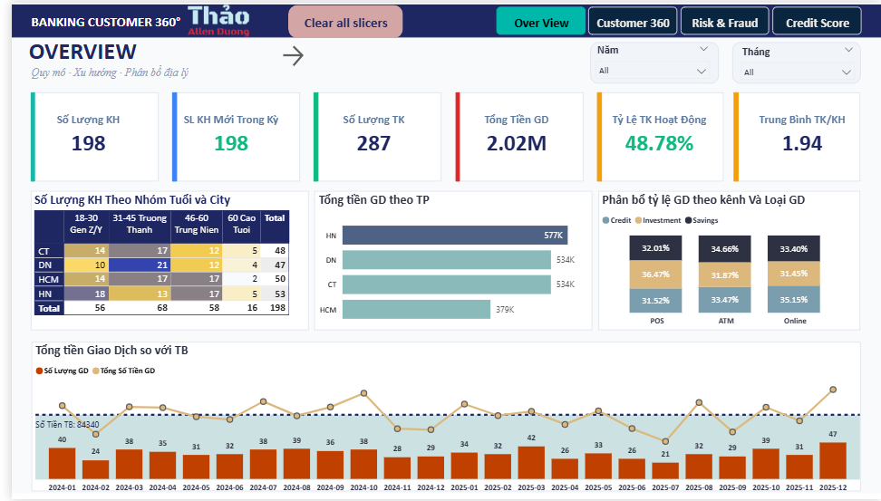

# Banking Customer 360°

### Power BI Dashboard for Retail Banking Analytics

*Solo build · ~3 tuần · SQL Server + Power Query + DAX + Power BI*

---

## 📊 What is this

Một dashboard build để hiểu khách hàng ngân hàng từ **4 góc nhìn** khác nhau — Executive, Sales, Risk, Credit. Gom data rời rạc từ 4 hệ thống (CRM · Core Banking · Credit Scoring · Fraud Detection) thành 1 dashboard tích hợp.

**Dataset:** 198 KH · 287 TK · 800 GD · 188 credit scores · 24 tháng + 12 quý *(synthetic data)*

---

## 🎯 Key Insights

> **1. Một nửa tài khoản đang "chết"**
>
> 51% TK inactive, tốn ~130 tỷ VNĐ/năm phí duy trì không tạo giá trị.

> **2. KH VIP không thực sự là VIP**
>
> VIP có quý xuống 324 điểm credit (Q1/2024), thấp hơn cả Mass. Định nghĩa VIP cần re-design.

> **3. Affluent là "weakest link" của ngân hàng**
>
> 53.23% giao dịch của Affluent có risk flag, cao hơn cả VIP (42%). Bị bỏ quên giữa VIP (chăm sóc kỹ) và Mass (tự động hóa).

→ Full storytelling + DAX/SQL deep dive: **[Notion portfolio](https://www.notion.so/D-ng-Ng-Th-o-Data-Business-Analysis-5bed19877e128386af2b0174d946a391?source=copy_link)**

---

## 🛠️ Tech Stack

| Layer | Tool | Purpose |
| --- | --- | --- |
| **Database** | SQL Server (Local) | Data profiling, 15 exploration queries |
| **ETL** | Power Query M | `dim_date` generation, type conversions |
| **Modeling** | Power BI Desktop | Star schema — 2 facts + 3 dims |
| **Calculation** | DAX | **148 measures** across 7 Display Folders |
| **Visualization** | Power BI + Inforiver | 4 pages · 17 visuals |
| **Documentation** | Markdown + Notion | This page + [Notion portfolio](https://www.notion.so/Banking-Customer-360-35ad19877e1280f99d08e26d2d944328?source=copy_link) |

---

## 📁 Repository Structure

| Folder | Contents |
| --- | --- |
| 📂 `data/` | 4 raw CSV files + schema documentation |
| 📂 `sql/` | 15 SQL queries for data profiling |
| 📂 `dax/` | DAX measures documentation — **148 measures** |
| 📂 `powerbi/` | `.pbit` template (no embedded data) |
| 📂 `screenshots/` | 4 dashboard pages + star schema |
| 📄 `README.md` | You're here |

---

## 🚀 How to Explore

### Option 1 — Read the story *(recommended for recruiters)*

👉 **[Full portfolio on Notion](https://www.notion.so/Banking-Customer-360-35ad19877e1280f99d08e26d2d944328?source=copy_link)**

### Option 2 — Clone & replay locally

1. Sao chép kho lưu trữ này
2. Mở file `powerbi/Banking_Customer_360.pbit` trong Power BI Desktop
3. Khi hệ thống chạy hoặc hỏi, hãy chọn vào thư mục `data/` để lấy dữ liệu
4. Refresh → dashboard sẽ load với data từ CSV

### Option 3 — Run SQL queries

1. Import 4 CSV vào SQL Server (database `BankingCustomer360`)
2. Mở `sql/analysis_queries.sql` trong SSMS
3. Chạy từng sections một (5 sections theo business question)

### Option 4 — Browse DAX measures

👉 **[`dax/dax_measures.md`](dax/dax_measures.md)** — 148 measures với 7 folders, highlighted measures kèm pattern note

---

## 📝 Notes & Limitations

- **Synthetic data** — Risk rate ~42% cao bất thường so với banking thực (1–5%). Pattern này là đặc trưng dataset học tập, không phải insight production.

- **Time range mismatch** — `transactions` phủ 2024–2025, `credit_scores` phủ 2023–2025 → một số slicer Year bị giới hạn.

- **Credit scores thưa** — ~1 record/customer/year → QoQ migration coverage thấp.

Full limitations: **[Notion Section 9](https://www.notion.so/Banking-Customer-360-35ad19877e1280f99d08e26d2d944328?source=copy_link)**

---

## 🙌 Contact

- 📧 **Email** — [allendthao@gmail.com](mailto:allendthao@gmail.com)

- 💼 **LinkedIn** — [linkedin.com/in/Dương-Thảo](https://linkedin.com/in/Dương-Thảo)

- 🌐 **Portfolio** — [Notion full version](https://www.notion.so/Banking-Customer-360-35ad19877e1280f99d08e26d2d944328?source=copy_link)

---

*Feel free to fork, adapt, and steal patterns.*
*Ghi nguồn nếu paste nguyên :)*

**⭐ Star this repo if you found it useful!**

